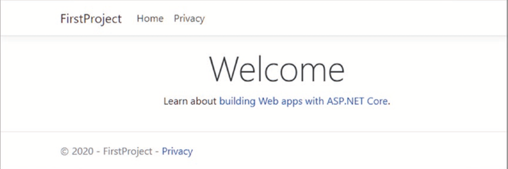

# Start ASP.Net Core
---
ASP.NET Core is a cross-platform, high-performance, open-source framework for building modern, cloud-enabled, Internet-connected apps. With ASP.NET Core, you can:
1. Build web apps and services, Internet of Things (IoT) apps, and mobile backends.
2. Use your favorite development tools on Windows, macOS, and Linux.
3. Deploy to the cloud or on-premises.
4. Run on .NET Core.

I will show how to create a simple web app by ASP.NET Core 3.1 by using 
Visual Studio Code and .Net Core CLI.

Open a command prompt navigates to a convenient location and run the commands to create a project.

``` 
dotnet new globaljson --sdk-version 3.1.301 --output FirstProject
dotnet new mvc --no-https --output PartyInvites --framework netcoreapp3.1
``` 

The first command creates a folder named FirstProject and adds to it a file named global.json, which specifies the version of .NET Core that the project will use; this ensures you get the expected results when following the examples. The second command creates a new ASP.NET Core project. The .NET Core SDK includes a range of templates for starting new projects, and the mvc template is one of the options available for ASP.NET Core applications. This project template creates a project that is configured for the MVC Framework, which is one of the application types supported by ASP.NET Core.

Then open the folder FirstProject and run the command to start the application.

```
dotnet run
```

And request `http:\\localhost:5000` and you can find the default welcome view page like this:

